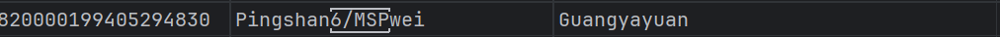

# Project 1
## Project Info
[【腾讯文档】Project1 Introduction](https://docs.qq.com/doc/DVmJ4Q2dNSGJnSXNv)
## Project Report Link
[Latex report](https://sharelatex.cra.ac.cn/project/66193f1fafc1ee76074e378e)--In Progress
##  E-R Diagram
[ER diagram](https://lucid.app/lucidchart/381208ad-beeb-4a6d-9209-00c39bd6f42d/edit?view_items=LPrsYmKL4.7G&invitationId=inv_45428aec-4b47-4305-88bb-a0c90220279f)--In progress


## Relational Database Design
TODO

## Data Import
<!-- psql -U postgres -d project1 -p 5432 -h localhost -->


### Deploy Python Version
#### Install Dependencies
```bash
conda create -n sql -y
conda activate sql
pip install -r requirements.txt
```

#### Set Environment Variables
Plase add a file named `.env` in `project1/Python` directory that looks like following:
```python
DB_NAME= # Your database name
DB_USER= # Your user Name
DB_PASSWORD= # Your passoword
DB_HOST=localhost # Your host address
DB_PORT=5432 # Port of the database
```

#### Execute
TODO

### Deploy C++ Version
#### Requirements
[libpqxx](https://github.com/jtv/libpqxx/blob/master/BUILDING-cmake.md)\
cmake\
postgesql
#### Set Environment Variables
Plase add a `bash` scipt named `setenv.sh` in `project1` directory that looks like following:
```bash
export DB_NAME= # Your database name
export DB_USER= # Your user Name
export DB_PASSWORD= # Your passoword
export DB_HOST=localhost # Your host address
export DB_PORT=5432 # Port of the database
```
then run the bash with
```bash
source ./setenv.sh
```

#### Compile
```bash
cd Cpp
```
```bash
chmod +x ./setup.sh
./setup.sh
```

#### Execute
```bash
chmod +x ./load.sh
./load.sh
```

#### Access Postgresql in WSL2
[link](https://askubuntu.com/questions/1222184/how-to-connect-datagrip-on-ubuntu-wsl-inside-windows)

#### MySQL Version
```bash
sudo apt-get install libmysqlclient-dev
```

### Deploy Java Version
TODO

### Load Speed Test
#### Fake Data Generation
```bash
cd ./Python
python fakeData.py
mv ./fakerides.json ../Data/fakerides.json
```

#### Execute
```bash
cd ./Cpp
./speed.sh
```


## Data Corruption Found
in `rides.json` :


in `stations.json`:
```json
"busName": "1、尚景欣园:802、低碳城假日专线、M276、M386、M556；2、盛平地铁站"
"busName": "中粮创芯公园北（原"
"busName": "角塘西:M198、M309、M521、M568、M597、高峰专线221B出入口城市山海云汇"
"busName": "万科城①,万科城②"
"busName": "A1、A2出入口丨鹏基工业区"
"busName": "福田公交枢纽站公交信息"
"chukou": "坪山人民医院：M479,818,939路B线,M143,M546路外环,939路A线,M546路内环,964路B出入口"
"chukou": "                                           B出入口"
"chukou": "D/E出入口"
"chukou": "B出入口/C出入口"
```
```json
{
"busInfo": "M165需删除、M361、M195需删除、M219、M276、E6、E7、E23、E33需删除、E34、M277、M304、M305、M359、818、M230、M136需删除、M266、高峰专线17（新增）",
"busName": "双龙地铁站②③"
}
```
```json
{
"busOutInfo": [],
"chukou": "此站暂无数据"
}
{
  "busInfo": "无B出入口",
  "busName": "吉祥地铁站"
}
```
```json
{
"busInfo": "B3出入口",
"busName": "海航城"
}
```
```json
          {
            "busInfo": "21、22、37、201、226、324高峰专线62、高峰专线138、M176、M343、M349、M425、M475、M492、M506",
            "busName": "中山公园东门"
          }
```
```json
{
"busInfo": "351、366、M239、M266、M295、M309、M570B出入口",
"busName": "横岗地铁站①"
}
```
```json
{
"busInfo": "101路 B681路（过铁路桥，距离G出入口约300米）",
"busName": "中医院一门诊"
}
```
```json
{
"busInfo": "103路 113路 12路 203路 214路 215路 3路 E8路 M156路 M190路 M192路 M559路 N3路",
"busName": "门诊部1西行方向"
},
{
"busInfo": "103路 113路 12路 203路 204路 204路快线 211路 214路 215路 337路 351路 3路 64路 E8路 M112路 M156路 M190路 M192路 M399路 M402路 M559路 N3路 N4路",
"busName": "东行方向"
},
{
"busInfo": "104路 10路 12路 203路 204路 204路快线 214路 215路 223路 29路 337路 3路 64路 85路 M112路 M156路 M239路 M559路 N3路 N4路",
"busName": "人民桥"
}
```
```json
{
"busInfo": "338；615；M371；M419；M472；M530",
"busName": "福围"
}
```
```json
{
"busInfo": "101路 B681路（过铁路桥，距离G出入口约300米）",
"busName": "中医院一门诊"
}
```
```json
{
"busInfo": "606、M425、M250、718、Peak Special Line102、B864、M393、M131、M313、M371、高峰专线138",
"busName": "富盈门站"
}
```
```json
{
"busInfo": "10路;12路;13路;216路;225路;303路;64路;M105路;M183路",
"busName": "妇幼保健院红荔院区（注 红荔路）"
}
{
"busInfo": "727；E31；M395",
"busName": "机场海关"
}
{
"busInfo": "10路;12路;13路;216路;225路;303路;64路;M105路;M183路",
"busName": "妇幼保健院红荔院区（注 红荔路）"
}
{
"busInfo": "B604、M267、M272、M346、M521、M572",
"busName": "象角塘西:M198、M309、M521、M568、M597、高峰专线221B出入口城市山海云汇"
}
{
"busInfo": "M317/M381/M466/M593.",
"busName": "大运地铁接驳站2"
}
{
"busInfo": "罗湖公安分局",
"busName": "公交站名"
}
{
"busOutInfo": [
{
"busInfo": "18路.63路.69路.303路.322路.323路.366路.371路.381路",
"busName": "笋岗街道办"
}
],
"chukou": "D出入口"
},
{
"busOutInfo": [
{
"busInfo": "18路.63路.69路.303路.322路.323路.366路.371路.381路.M406",
"busName": "笋岗街道办"
}
],
"chukou": "C1出入口"
},
{
"busOutInfo": [
{
"busInfo": "18路.57路.255路.322路.381路.M406",
"busName": "笋岗村牌坊"
}
],
"chukou": "C2出入口"
}
{
"busInfo": "320.M131.M330.M350.M377.M382.M470.M507.高峰专线158.高峰专线32.西湾公园假日专线1C出入口",
"busName": "坪洲地铁站"
}
{
"busInfo": "B992  2.B1出入口",
"busName": "前海湾地铁站"
}
          {
            "busInfo": "无",
            "busName": "红花山地铁站"
          }
{
"busOutInfo": [
{
"busInfo": "M486、M487、N90、N4、21、26、70、90、101、42、113、223、M191、M312、高峰专线3.C出入口丨世界之窗②::M194、M222、M413、323、324、369、M448",
"busName": "A出入口丨世界之窗①"
},
{
"busInfo": "392、66、43、M535、M435、高峰专线36、395、320H出入口丨世界之窗①",
"busName": "C、H出入口丨公交接驳站"
},
{
"busInfo": "323、324、369、M191、M194、M222、M413、M448",
"busName": "H出入口丨世界之窗②"
}
],
"chukou": ""
}
          {
            "busInfo": "暂无线路停靠",
            "busName": "后瑞地铁站 ③"
          }
                    {
            "busInfo": "m598、m552、m234",
            "busName": "后亭地铁站"
          }
                    {
            "busInfo": "366，833，915，b760，e20，m295，m326，m434，m439，m443，m479，m575，m576，高峰专线64",
            "busName": "坪山电子城②"
          }
                {
        "outt": "A1出入口",
        "textt": "深汕路北侧（西）、坪山宝山第二工业区、宝山垃圾转运站、志远培训学校                                                                   A2出入口: 深汕路北侧（西）、坪山宝山第三工业区、六和地铁站公交站                                                                                                    A3"
      }
            {
        "outt": "                                                                         B 出入口",
        "textt": "龙平西路南侧（东）、吉祥中路、城市花园、深圳龙岗汽车总站"
      },
          "out_info": [
      {
        "outt": "1/2号出入口",
        "textt": "大运软件小镇"
      },
      {
        "outt": "（1号出入口暂未开通）3号出入口",
        "textt": "龙飞大道南侧、龙岗大道西侧"
      },
      {
        "outt": "4/5/6号出入口",
        "textt": "龙岗大道西侧、桂坪路口"
      },
      {
        "outt": "（4号出入口暂未开通）7号出入口",
        "textt": "龙岗大道西侧"
      },
      {
        "outt": "8/9a/9b/10a/10b号出入口",
        "textt": "大运软件小镇、龙岗大道东侧"
      },
      {
        "outt": "（9a/9b号出入口暂未开通）11号出入口",
        "textt": "龙飞大道北侧、龙岗大道西侧"
      },
      {
        "outt": "12号出入口",
        "textt": "荷风路"
      },
      {
        "outt": "13号出入口",
        "textt": "龙飞大道南侧、龙岗大道西侧"
      },
      {
        "outt": "14a/14b/14c号出入口",
        "textt": "深圳市大运综合交通枢纽"
      }
      "intro": "燕子湖站（Yanzihu Station），位于中国广东省深圳市坪山区，是深圳地铁16号线的一座地铁车站。 该站于2022年12月28日投入运营。 燕子湖站（Yanzihu Station），位于中国广东省深圳市坪山区，是深圳地铁16号线的一座地铁车站。 该站于2022年12月28日投入运营。 "
      
```

in `lines.json`:
```json
"Universiade",
"Universiade Center",
"  Longcheng Park",
"Huanggekeng  station",
"Yuyuan  station",
"Huilongpu  station\n",
"Liuyue North",
```
in `rides.json`:
```json
"start_station": "Huilongpu  station\n",
```
```json
"end_station": "Dongjiang Column Memorial \nHall Station",
```

in `stations.json`:
the original district for nonglin station is "\西丽线"， we corrected it into "福田区"

in ‘stations.json': the "K578(右环)" is correctetd to “K578（右环）" since the latter one is more commonly used.
```json
"Pingshan wei": {
```
